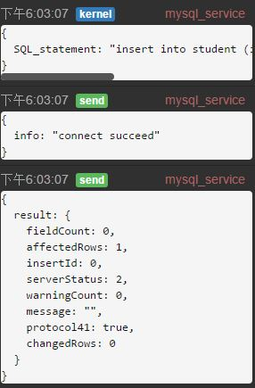
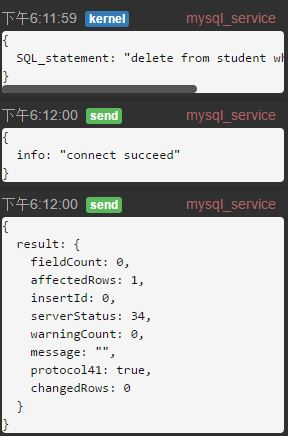
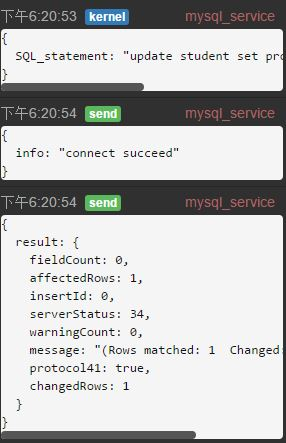
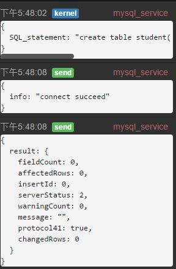

mysql服务
================

#描述
为使用该内置服务, 你需要在自己的电脑上安装mysql, 并且设置好相关配置。
对于mysql内置服务,你需要在模块相应的配置栏输入主机，端口，mysql用户
名，mysql密码，然后在输入栏输入SQL语句即可。

#SQL语句

## 插入

### 描述

插入数据

### 配置

`主机名`: 字符串.

`端口号`: 整型.

`数据库`: 字符串.

`用户名`: 字符串.

`密码`: 字符串.

### 输入

`SQL 语句`: 字符串.

### 输出

`结果`: 字符串.

`信息`: 字符串.

### 例子

`主机名`: host.

`端口号`: port.

`数据库`: mysql database.

`用户名`: mysql username.

`密码`: mysql password.

`SQL 语句`:insert into student (id,name,profession) values (101,'xiaoming','CS')

`结果`: result.

`信息`: 'connect succeed'

`功能`: 将记录 (id:10,name:xiaoming,profession:CS)
插入表student.

## 删除

### 描述

删除记录

### 配置

`主机名`: 字符串.

`端口号`: 整型.

`数据库`: 字符串.

`用户名`: 字符串.

`密码`: 字符串.

### 输入

`SQL 语句`: 字符串.

### 输出

`结果`: 字符串.

`信息`: 字符串.

### 例子

`主机名`: host.

`端口号`: port.

`数据库`: mysql database.

`用户名`: mysql username.

`密码`: mysql password.

`SQL 语句`: delete from student where name='lihua'

`结果`: result.

`信息`: 'connect succeed'.

`功能`: 删除student表中姓名是lihua的记录.

## 更新

### 描述

更新数据

### 配置

`主机名`: 字符串.

`端口号`: 整型.

`数据库`: 字符串.

`用户名`: 字符串.

`密码`: 字符串.

### 输入

`SQL 语句`: 字符串.

### 输出

`结果`: 字符串.

`信息`: 字符串.

### 例子

`主机名`: host.

`端口号`: port.

`数据库`: mysql database.

`用户名`: mysql username.

`密码`: mysql password.

`SQL 语句`: update student set profession='Physics' where name ='zihua'

`结果`: result

`信息`: 'connect succeed'.

`功能`: 将student表中姓名是zihua的记录的专业改为Physics.

## 查询

### 描述

查询数据

### 配置

`主机名`: 字符串.

`端口号`: 整型.

`数据库`: 字符串.

`用户名`: 字符串.

`密码`: 字符串.

### 输入

`SQL 语句`: 字符串.

### 输出

`结果`: 字符串.

`信息`: 字符串.

### 例子

`主机名`: host.

`端口号`: port.

`数据库`: mysql database.

`用户名`: mysql username.

`密码`: mysql password.

`SQL 语句`: select * from student where name='xiaoming'

`结果`: result.

`信息`: `connect succeed`

`功能`: 查询student表中姓名是xiaoming所在记录的所有信息.

## 创建数据表

### 描述

创建数据表

### 配置

`主机名`: 字符串.

`端口号`: 整型.

`数据库`: 字符串.

`用户名`: 字符串.

`密码`: 字符串.

### 输入

`SQL 语句`: 字符串.

### 输出

`结果`: 字符串.

`信息`: 字符串.

### 例子

`主机名`: host.

`端口号`: port.

`数据库`: mysql database.

`用户名`: mysql username.

`密码`: mysql password.

`SQL 语句`: create table student( id int not null, name char(20), profession char(20)).

`结果`: result.

`信息`: 'connect succeed'

`功能`: 在已选数据库中创建student数据表，有id,name,profession三个属性. 

## 删除数据表

### 描述

删除数据表

### 配置

`主机名`: 字符串.

`端口号`: 整型.

`数据库`: 字符串.

`用户名`: 字符串.

`密码`: 字符串.

### 输入

`SQL 语句`: 字符串.

### 输出

`结果`: 字符串.

`信息`: 字符串.

### 例子

`主机名`: host.

`端口号`: port.

`数据库`: mysql database.

`用户名`: mysql username.

`密码`: mysql password.

`SQL 语句`: drop table student.

`结果`: result.

`信息`: 'connect succeed'.

`功能`: 将已选数据库中student表删除.
