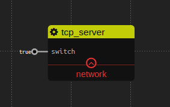

网络服务
=============

## http请求

### 描述

提供发送http请求的服务。
被[REQUEST](https://www.npmjs.com/package/request)实现。

### 配置

‘url’：字符串，http请求的url，如果这个url没有以‘http://’开头，则会被添加上‘http://’。

‘method’：字符串，请求方法，现在只支持‘get’,'post','put','delete','patch'这５个方法。

‘headers’：对象，请求头部，默认是‘{}’。

‘body’：对象，请求主体，默认是‘{}’。

‘proxy’：字符串，可选参数，可以手动配置代理。

‘timeout’：数值，请求时限，默认是‘500000’(50s)。

### 输入

‘switch’：布尔型，判断是否发送http请求，如果值为true，就会发送http请求，并格式化响应数据。

### 输出

‘out’：字符串，http请求结果，包括‘状态码’，‘头部’，‘主体’。

### 例子


在这个例子中，向 http://www.baidu.com发送了一个请求，并将结果写进了文件中。

</br>

### Output Format

```javascript
{
    "statusCode": 200,
    "headers": "response.headers",
    "body": "response.body"
}
```

##网络状态

### 描述

提供获得本机IPv4网络状态的服务。

### 输入

`switch`: 布尔型，判断是否获得网络状态，如果值为true，从服务响应本机IPv4网络状态。

### 输出

`status`: 对象，网络状态，如果没有可用的IPv4外网，响应的状态信息为`null`。
### 例子


在这个例子中，我们将本机IP显示在 `Text` 部件上。

function code
```javascript
if(in!=null){
	return in.address;
}
```

### 输出格式

```javascript 
null or {
    		address: '10.10.7.138',
   	 		netmask: '255.255.240.0',
    		family: 'IPv4',
    		mac: '30:5a:3a:bd:fb:cc',
    		internal: false
		}
```

</br>


## tcp请求

### 描述

提供发送tcp请求的服务

### 配置

‘ip’：字符串，服务器ip地址。

‘port’：数值，服务器端口。


### 输入

‘switch’：布尔型，判断是否发送tcp请求，如果值为true,就会发送请求，并格式化响应数据。

‘data’：字符串，发送给服务器的数据。

### 输出

‘out’：字符串，从服务返回的响应信息。

### 例子


在这个例子中，每隔３秒钟就会向127.0.0.1:9999发送一个请求，并用‘Text’ widget显示响应信息。

</br>

## tcp服务器

### 描述

通过这个服务可以创建一个简单的tcp服务器。

### 配置

‘ip’：字符串，监听ip地址，默认是‘0.0.0.0’。

‘port’：数值，监听端口。

‘f(data)’：函数，处理来自客户端的数据。

### 输入

‘switch’：布尔型，判断是否开启tcp服务器，如果值为true，则会开启tcp服务器，否则关闭tcp服务器。

### 例子



在这个例子中，创建了一个tcp服务器监听0.0.0.0:9999，当客户端发送数据时，就会在这个数据后面添加‘hello’。

function code
```javascript
return data.toString() + "hello";
```

</br>

## udp请求

### 描述

提供发送udp请求的服务。

### 配置

'ip'：字符串，服务器ip地址。

‘port’：数值，服务器端口。

### 输入

‘switch’：布尔型，判断是否发送udp请求，如果值为true，就会发送请求，并格式化响应信息。

‘data’：字符串，发送给服务器的信息。

### 输出

‘out’：字符串，服务器的响应信息。

###　例子

参照tcp请求的例子。

</br>

## udp服务器

###　描述

提供创建一个简单的udp服务器的功能。

###　配置

‘ip’：字符串，监听ip，默认是'0.0.0.0'。

‘port’：数值，监听端口。

‘f(data)’：函数，处理来自与客户端的数据。

### 输入

‘ip’：字符串，监听ip，默认是'0.0.0.0'。

‘port’：数值，监听端口。

‘f(data)’：函数，处理来自于客户端的数据。

###　输入

‘switch’：布尔型，判断是否开启udp服务器，如果值为true，服务器就会开启，否则关闭。

### 例子

参照tcp服务器的例子。
