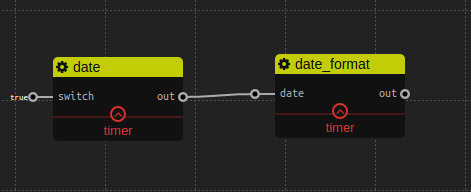

计时器
================

## 日期

### 描述

输出当前日期

### 输入

‘switch’：布尔型，判断是否输出日期。

### 输出

‘out’：日期类型，当前日期对象。

### 输出格式
```javascript
2016-08-05T02:54:16.462Z
```
## 日期格式化

### 描述

将接收到的日期对象根据指定格式进行转换。

### 输入

‘date’：日期类型，输入日期对象，如果‘date’不是‘Date’的一个实例，则使用当前日期。

### 输出

‘out’：字符串，格式化结果。

### 例子



在这个例子中，使用‘date’服务，以格式‘yyyy-MM-dd hh:mm:ss’输出日期信息，‘out’：2016-08-05 11:02:40。


## 延时触发

### 描述

每当`in`端口有信息到来,延时`delay`ms后再发送

### 输入

`delay`: 整数 默认值1000 非触发信号，设置延时。

`in`: 任意类型

### 输出

`out`: 任意类型 延时输出`in`的内容

### 样例


图中加法完成后，会延时1秒再输出结果3


## 间隔触发

### 描述

每间隔`interval``ms,`out`就会输出1

### 输入

`in`: 整数 默认值1000 设置间隔时间 

### 输出

`out`: 整数 每间隔`interval``ms,输出1

### 样例


每经过1s，都会输出“hello”

## 时间戳

### 描述

接收日期对象并根据时间戳进行输出。

### 输入

‘date’：日期类型，输入日期类型，如果‘date’不是‘Date’的实例，将会输出当前日期。

### 输出

‘out’：字符串，时间戳。

### 例子


在这个例子中使用‘date’服务产生日期，然后输出时间戳。
‘out’：1470366406291