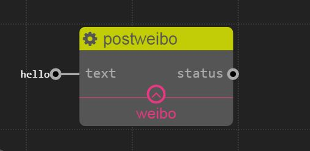
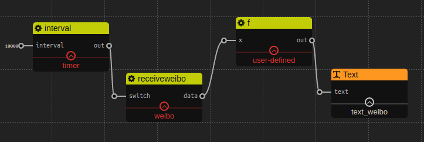

sina weibo
================
## postweibo

### Description

This service provides ability for post message to sina weibo.

It is implemented by [node-weibo-twitter](https://www.npmjs.com/package/node-weibo-twitter)

At this stage, only supports plain-text message, and don't support the network proxy.

### Config

`token`: String. The access token of weibo account.

### Inport

`text`: String. The message content of weibo.

### Outport

`status`: Boolean. Output true if success to sending, otherwise false.

### Example



In this example, we post a weibo message with "hello".


## receiveweibo

#### Description

This service provides ability for receive message to sina weibo.

It is implemented by [Request](https://www.npmjs.com/package/request)

There are two mode of receving message.One is `all` mode which means that everytime you will get the all message.The other is `new` mode which means that everytime you will only get the new message based on last received message.

### Config

`token`: String. The access token of weibo account.

`type`: String. The receive mode. It must be `all` or `new`.

`proxy`: String. Optinal. You can set the proxy manually.

### Inport

`switch`: Boolean. The switching signal of receive weibo. If it's true, this service will send request and format response data.

### Outport

`data`: Object. The message of weibo. Attention:The format of data is Object which means that you can't simply show it using `Text` widget. You may need `f`(user-defined) to show it.

### Example


### Output Format

```javascript
[
    {
        "created_at": "Tue May 31 17:46:55 +0800 2011",
        "id": 11488058246,
        "text": "求关注。"，
        "source": "<a href="http://weibo.com" rel="nofollow">新浪微博</a>",
        "favorited": false,
        "truncated": false,
        "in_reply_to_status_id": "",
        "in_reply_to_user_id": "",
        "in_reply_to_screen_name": "",
        "geo": null,
        "mid": "5612814510546515491",
        "reposts_count": 8,
        "comments_count": 9,
        "annotations": [],
        "user": {
            "id": 1404376560,
            "screen_name": "zaku",
            "name": "zaku",
            "province": "11",
            "city": "5",
            "location": "北京 朝阳区",
            "description": "人生五十年，乃如梦如幻；有生斯有死，壮士复何憾。",
            "url": "http://blog.sina.com.cn/zaku",
            "profile_image_url": "http://tp1.sinaimg.cn/1404376560/50/0/1",
            "domain": "zaku",
            "gender": "m",
            "followers_count": 1204,
            "friends_count": 447,
            "statuses_count": 2908,
            "favourites_count": 0,
            "created_at": "Fri Aug 28 00:00:00 +0800 2009",
            "following": false,
            "allow_all_act_msg": false,
            "remark": "",
            "geo_enabled": true,
            "verified": false,
            "allow_all_comment": true,
            "avatar_large": "http://tp1.sinaimg.cn/1404376560/180/0/1",
            "verified_reason": "",
            "follow_me": false,
            "online_status": 0,
            "bi_followers_count": 215
        }
    },
    ...
]
```

For more information about the data format, you can visit [weibo api document](http://open.weibo.com/wiki/2/statuses/friends_timeline).
